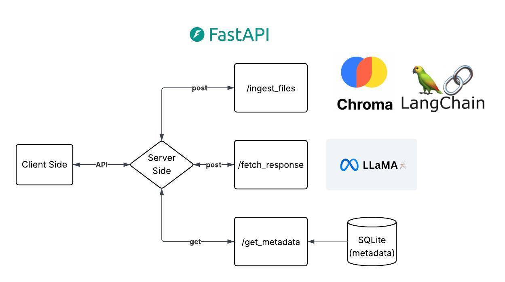

## Retrieval Augmented Generation (RAG)



- [API Functionality](#api-functionality)  
- [Deployment](#deployment)

---

## API Functionality

The API is built with **FastAPI** using a REST architecture. It has three endpoints with the following functionalities:

### 1) `/ingest_files`

**Parameters**:
- `group_name`: Name for the collection of the currently uploaded documents. Used later while querying this set.
- `files` (multi-part byte streams): Files to be uploaded. Currently supports only **PDF** and **DOCX** (Microsoft Word) formats.
- `metadata`: User-defined custom metadata for the uploaded documents.

This endpoint reads the uploaded documents using file-specific tools to extract text. It then preprocesses the text, which includes chunking while maintaining structural integrity, and generates embeddings for each chunk for semantic-based retrieval.

The embedding model used is `M2-BERT-80M-2K-Retrieval`, a BERT-based model with 2K context length specifically trained for retrieval tasks based on semantic similarity.

Embeddings, document chunks, and metadata are stored in a persistent local vector database using **ChromaDB**.

---

### 2) `/fetch_response`

**Parameters**:
- `query`: Raw user query for retrieval and response generation.
- `group_name`: The collection name to perform the retrieval against.
- `include_chunks` (optional): If true, includes the chunks used in the response generation in the response JSON.

This endpoint takes a user query and maps it into the continuous vector space to perform semantic similarity-based retrieval. Chunks are retrieved based on cosine similarity between the query vector and document chunk vectors.

The retrieved chunks are then used as context for final response generation using an LLM. This project uses `meta-llama-3.3-70B`, the latest open-source chat model by MetaAI, instruction-tuned for RAG and user assistance tasks.

---

### 3) `/get_metadata`

A simple GET endpoint to retrieve all document metadata grouped by their respective collections. The response is structured in valid JSON.

---

## Deployment

### Locally

- Clone the project:
```bash
git clone https://github.com/abangwal/panscience-assignment.git
```
- Build the Docker app:

```bash
docker build -t my-fastapi-app . 
```
- Run the app locally:

```bash
docker run -d -p 7860:7860 --name fastapi-container my-fastapi-app
```
- Open FastAPI Swagger-style API docs:

```text
http://127.0.0.1:7860/docs
```

- Run tests (after Docker container initializes):

```bash
python3 test/unit_test.py
```